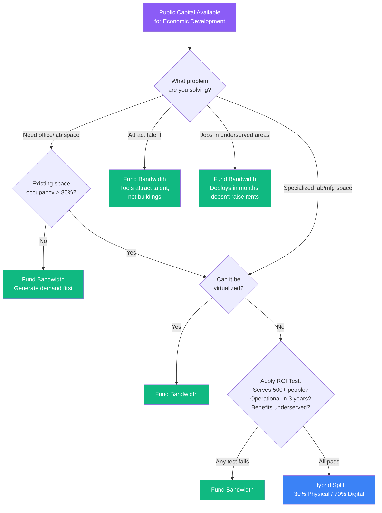

# Decision Tree: Fund Buildings or Bandwidth?

## The Core Question

When public capital is available for economic development, should it go to physical infrastructure (buildings, real estate, construction) or digital infrastructure (cloud, AI, connectivity, APIs)?

## Decision Framework

### Step 1: What problem are you solving?

**A. "We need more office/lab space for startups"**
→ Before funding construction, ask: Is the existing space fully utilized? If occupancy < 80%, the problem isn't space — it's demand. Fund bandwidth to generate demand, then space fills naturally.

**B. "We need to attract talent and companies"**
→ Talent and companies go where the tools are, not where the buildings are. Fund bandwidth — AI tools, cloud credits, and connectivity attract remote talent and distributed teams.

**C. "We need to create jobs in underserved neighborhoods"**
→ Buildings in underserved areas take years and often gentrify. Digital infrastructure (Wi-Fi, AI tools, business formation) deploys in months and doesn't raise rents. Fund bandwidth.

**D. "We need specialized lab/manufacturing space"**
→ This is the legitimate case for physical investment. If the need requires physical infrastructure that can't be virtualized (wet labs, clean rooms, manufacturing), fund the building. But fund *only* the building — everything else should be bandwidth.

### Step 2: Apply the ROI Test

| Question | If Yes → | If No → |
|----------|----------|---------|
| Can the same outcome be achieved with digital infrastructure? | Fund bandwidth | Proceed to physical evaluation |
| Will the physical investment serve < 500 people? | Fund bandwidth instead (higher reach per dollar) | Proceed |
| Will the physical investment take > 3 years to become operational? | Fund bandwidth as a bridge, then evaluate physical | Proceed |
| Does the physical investment primarily benefit an already-advantaged area? | Fund bandwidth to distribute benefits more broadly | Proceed |
| Is there an existing physical asset that's underutilized? | Fund bandwidth to activate the existing asset | Proceed |

### Step 3: The Hybrid Split

If physical investment IS justified, apply the 70/30 rule:

- **30% to physical infrastructure** (the building, lab, or facility that can't be virtualized)
- **70% to digital infrastructure** (the connectivity, AI tools, and APIs that make the physical asset accessible to the whole city)

This ensures that every physical investment is digitally connected from day one.

## Cost Comparison Framework

| Investment Type | Cost Range | People Served | Time to Impact | Replicability |
|----------------|-----------|---------------|----------------|---------------|
| New building/lab | $5M - $50M | 50 - 500 direct | 2-5 years | Not replicable |
| Building renovation | $2M - $20M | 25 - 250 direct | 1-3 years | Not replicable |
| Co-working space | $500K - $5M | 50 - 200 direct | 6-12 months | Somewhat |
| Corridor Wi-Fi | $50K - $200K | 5,000 - 50,000 | 3-6 months | Fully replicable |
| AI tool deployment | $50K - $300K | Unlimited | 1-3 months | Fully replicable |
| Cloud infrastructure | $10K - $100K/year | Unlimited | Days to weeks | Fully replicable |
| Full Digital Mainstreet | $100K - $500K | 10,000 - 100,000 | 6-12 months | Fork and deploy |

## Talking Points for Funding Conversations

**When advocating for bandwidth over buildings:**

"Every dollar spent on a building serves the people inside it. Every dollar spent on digital infrastructure serves everyone who connects to it. For the same budget as one building renovation, we can deploy a Digital Mainstreet that reaches 100x more people."

**When someone insists on physical investment:**

"The building is Layer 0. Without Layers 1-4 — connectivity, intelligence, applications, distribution — the building is just a building. Fund the digital layers alongside the physical asset, and the building becomes a node on a network instead of an island."

**When the conversation is about equity:**

"Physical investments in underserved areas have a 20-year track record of producing gentrification, not inclusion. Digital infrastructure doesn't raise rents, doesn't displace residents, and doesn't require relocating to benefit. The Wi-Fi is free. The AI tools are free. The address on the business registration is the entrepreneur's home address."
