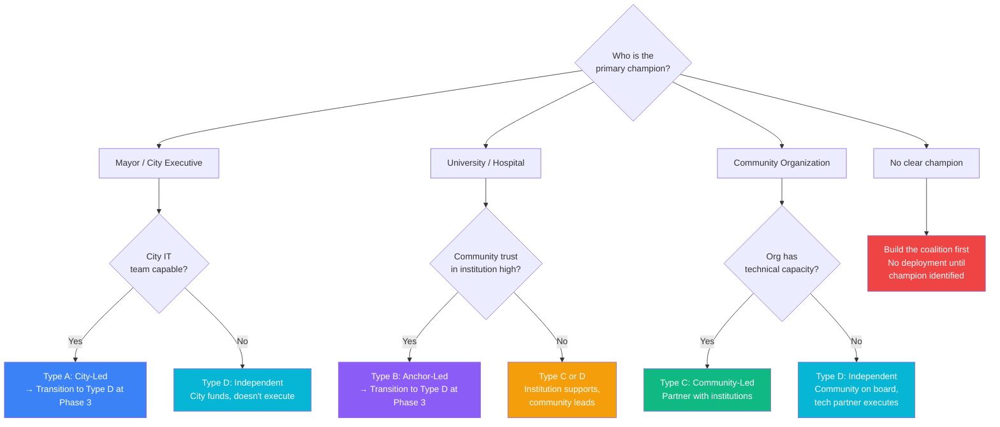

# Decision Tree: Partnership Model

## Purpose

Determine the right structure for public-private-community partnerships at each phase of Digital District deployment.

## Partnership Archetypes

### Type A: City-Led (Municipal Authority Model)

```
Best when:
├── City has strong IT capacity
├── Mayor is the champion
├── Funding comes primarily from municipal budget
└── Speed is more important than consensus

Structure: City department or authority with advisory boards
Risk: Perceived as government project, community skepticism
Example: Municipal broadband utilities
```

### Type B: Anchor-Led (Institutional Model)

```
Best when:
├── A university or hospital is the primary champion
├── Existing institutional infrastructure to build on
├── Research/innovation mission alignment
└── Institutional credibility is high in the community

Structure: University-affiliated center with city partnership
Risk: Institutional priorities may override community needs
Example: University innovation centers expanding to community
```

### Type C: Community-Led (Coalition Model)

```
Best when:
├── Strong community organizations exist on the corridor
├── Trust in government/institutions is low
├── Equity is the primary driver
└── Patience for slower, consensus-based process

Structure: Community development organization with city/institution support
Risk: Slower execution, harder to maintain technical capacity
Example: Community development corporations with tech mandates
```

### Type D: Independent (Public Benefit Entity)

```
Best when:
├── No single institution should control the ecosystem
├── Multiple stakeholders with equal power
├── Need for neutrality across sectors
└── Long-term sustainability beyond any single funder

Structure: Independent nonprofit or public benefit corporation with multi-stakeholder board
Risk: Needs dedicated leadership and operational funding
Example: Digital district authority (recommended for scaled deployments)
```

## Decision Flow



```
Who is the primary champion?

├── Mayor / City Executive → Is the city IT team capable?
│   ├── YES → Type A (City-Led) for Phase 1
│   │         Transition to Type D at Phase 3
│   └── NO → Type D (Independent) from the start
│             City provides funding, not execution
│
├── University / Hospital → Is community trust in the institution high?
│   ├── YES → Type B (Anchor-Led) for Phases 1-2
│   │         Transition to Type D at Phase 3
│   └── NO → Type C or D
│             Institution provides resources, community leads
│
├── Community Organization → Does the org have technical capacity?
│   ├── YES → Type C (Community-Led)
│   │         Partner with institutions for scale
│   └── NO → Type D (Independent)
│             Community org on the board, technical partner executes
│
└── No clear champion → Build the coalition first
    See Path E in decision-tree-start.md
```

## Partnership Agreement Essentials

Every partnership, regardless of type, must include:

1. **Roles and responsibilities** (RACI matrix — see governance-model.md)
2. **Funding commitments** (who pays for what, for how long)
3. **IP ownership** (open-source by default; any proprietary components specified)
4. **Data governance** (who controls user data — always the user)
5. **Exit terms** (what happens if a partner leaves)
6. **Community representation** (minimum community seats on governing body)
7. **Equity commitments** (measurable targets for underserved community participation)
8. **Conflict resolution** (binding process for disputes)
9. **Sunset/transition clause** (how the partnership evolves as the ecosystem matures)

## Red Flags in Partnership Negotiations

| Red Flag | What It Means | Action |
|----------|--------------|--------|
| Partner wants exclusive control of user data | Power grab, not partnership | Non-negotiable: user owns their data |
| Partner won't commit funding beyond 12 months | Low conviction | Negotiate 3-year minimum or find different partner |
| No community seats on governing body | Not a real partnership | Require minimum 30% community representation |
| Partner wants to own the IP | Wants to monetize public investment | Open-source commitment required |
| "We'll figure out governance later" | Governance will never happen | Define governance before writing code |
| Partner requires vendor lock-in | Self-serving, not ecosystem-serving | Open standards requirement non-negotiable |
