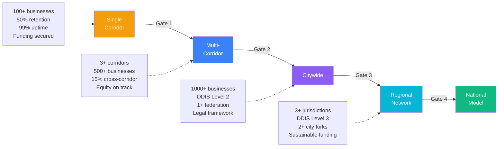

# Decision Tree: Scaling Readiness

## When to Expand from Street → City → Region

### Gate 1: Street to Multi-Corridor

**Are ALL of these true?**

- [ ] Phase 1 exit criteria met on pilot corridor
- [ ] At least 100 active businesses using the system
- [ ] 12-month retention rate > 50%
- [ ] Community satisfaction score > 3.5/5
- [ ] Infrastructure uptime > 99%
- [ ] At least 2 cross-node integrations operational
- [ ] Funding secured for next corridor deployment

**ALL YES** → Proceed to multi-corridor expansion (Phase 2-3)
**ANY NO** → Strengthen the pilot. Identify the weakest gate and address it.

### Gate 2: Multi-Corridor to Citywide

**Are ALL of these true?**

- [ ] At least 3 corridors operational
- [ ] Cross-corridor usage > 15% (users accessing services on corridors other than their home)
- [ ] Total active businesses > 500
- [ ] Governance model proven across multiple communities
- [ ] API infrastructure handling 10,000+ requests/day reliably
- [ ] Political commitment for citywide investment secured
- [ ] Equity metrics on track (40%+ entrepreneurs from underserved neighborhoods)

**ALL YES** → Deploy citywide digital layer (Phase 3)
**ANY NO** → Continue strengthening corridors. Citywide is premature.

### Gate 3: City to Regional Network

**Are ALL of these true?**

- [ ] Citywide layer operational and stable
- [ ] At least 1,000 active businesses
- [ ] Interoperability standard (DDIS) Level 2 conformance achieved
- [ ] Identity federation tested with at least 1 external district
- [ ] At least 1 neighboring jurisdiction requesting connection
- [ ] Legal framework for cross-jurisdictional data sharing established

**ALL YES** → Expand to regional network
**ANY NO** → Focus on deepening citywide deployment. Regional is premature.

### Gate 4: Regional to National Model

**Are ALL of these true?**

- [ ] Regional network with 3+ connected jurisdictions
- [ ] DDIS Level 3 conformance achieved
- [ ] At least 2 other cities have successfully forked and deployed the model
- [ ] National media coverage documenting the model
- [ ] Sustainable funding model proven (not dependent on single grant)
- [ ] Open-source community actively contributing

**ALL YES** → The model is nationally viable. Focus on standards, interoperability, and supporting other cities.
**ANY NO** → Continue strengthening regional operations.

## Common Scaling Mistakes

| Mistake | Why It Happens | Consequence |
|---------|---------------|-------------|
| Scaling before pilot is proven | Political pressure to show growth | Weak system spread thin, fails everywhere |
| Adding corridors without governance scaling | Governance works at 1 corridor, breaks at 3 | Community trust erodes, conflicts unresolved |
| Technical scaling without ops scaling | Engineers deploy, nobody operates | Outages, security gaps, user frustration |
| Ignoring equity during expansion | Path of least resistance is already-advantaged areas | Digital District replicates the Innovation District's equity failure |
| Scaling technology without scaling community engagement | Engagement is expensive and slow | New corridors have tools but no users |
