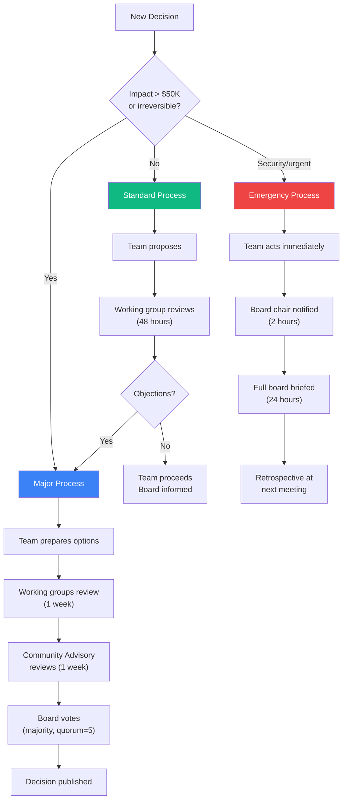

# Governance Model

## Principles

1. **Community-centered:** Residents and local businesses have meaningful decision power, not just advisory roles.
2. **Distributed authority:** No single institution controls the ecosystem.
3. **Transparent:** Decisions, data, and finances are publicly accessible.
4. **Evolving:** Governance structure adapts as the ecosystem grows.

## Governance Structure

```
┌───────────────────────────────────────────┐
│          DIGITAL DISTRICT AUTHORITY        │
│  (Public benefit entity or municipal unit) │
│                                           │
│  Board: 9 seats                           │
│  - 3 Community representatives            │
│  - 2 City government                      │
│  - 2 Institutional partners               │
│  - 1 Technology / builder community       │
│  - 1 Independent / at-large               │
└──────────────────┬────────────────────────┘
                   │
        ┌──────────┼──────────┐
        │          │          │
   ┌────▼───┐ ┌───▼────┐ ┌───▼────┐
   │Community│ │Tech    │ │Policy  │
   │Advisory │ │Working │ │Working │
   │Board    │ │Group   │ │Group   │
   └────┬───┘ └───┬────┘ └───┬────┘
        │         │          │
   ┌────▼─────────▼──────────▼────┐
   │    OPERATIONAL TEAM           │
   │  (Staff / contractors)        │
   │  - Product Manager            │
   │  - Infrastructure Engineer    │
   │  - Community Engagement Lead  │
   │  - Data / Analytics Lead      │
   └──────────────────────────────┘
```

## RACI Matrix

**R** = Responsible (does the work) | **A** = Accountable (final decision) | **C** = Consulted | **I** = Informed

| Decision Area | DD Authority Board | Community Advisory | Tech Working Group | Policy Working Group | Operational Team |
|--------------|-------------------|-------------------|-------------------|---------------------|-----------------|
| **Strategic direction** | A | C | C | C | I |
| **Budget allocation** | A | C | I | C | R |
| **Technology selection** | I | I | A | C | R |
| **Data governance policy** | A | C (veto power) | C | R | I |
| **Corridor expansion decisions** | A | C | C | C | R |
| **Community engagement approach** | C | A | I | I | R |
| **API standards** | I | I | A | I | R |
| **Partnership agreements** | A | C | C | C | R |
| **Hiring / staffing** | A | I | I | I | R |
| **Metrics and reporting** | A | C | C | I | R |
| **Equity and inclusion policy** | C | A | I | R | R |
| **Interoperability standards** | I | I | A | C | R |

## Community Advisory Board — Special Powers

The Community Advisory Board has **veto power** over:
- Data governance policies that affect residents
- Equity and inclusion metrics and targets
- Any decision that could result in displacement or exclusion
- Use of personally identifiable information

This is not a token advisory role. The veto is real and enforceable.

## Decision-Making Process



### Standard Decisions (< $50K impact, reversible)
1. Operational team proposes
2. Relevant working group reviews (48 hours)
3. If no objections, team proceeds
4. Board informed at next meeting

### Major Decisions ($50K+, strategic, or irreversible)
1. Operational team prepares proposal with options
2. All working groups review (1 week)
3. Community Advisory Board reviews (1 week)
4. Board votes (simple majority, quorum = 5)
5. Decision published to public record

### Emergency Decisions (security incidents, urgent operational needs)
1. Operational team acts immediately
2. Board chair notified within 2 hours
3. Full board briefed within 24 hours
4. Retrospective and ratification at next meeting

## Meeting Cadence

| Body | Frequency | Duration | Format |
|------|-----------|----------|--------|
| DD Authority Board | Monthly | 90 minutes | Hybrid (in-person + virtual) |
| Community Advisory Board | Monthly | 60 minutes | In-person on corridor |
| Tech Working Group | Biweekly | 60 minutes | Virtual |
| Policy Working Group | Monthly | 60 minutes | Hybrid |
| Operational Team | Weekly | 30 minutes | Virtual standup |
| All-Hands (public) | Quarterly | 2 hours | In-person, open to public |

## Conflict Resolution

| Conflict Type | Resolution Process |
|--------------|-------------------|
| Between working groups | Escalate to Board; Board decides with simple majority |
| Between Board and Community Advisory | Community Advisory veto holds on their designated topics; Board mediates on others |
| Between nodes (Innovation Districts) | Neutral mediator from Board + affected node representatives |
| Community complaint | Community Advisory Board investigates, recommends action to Board |
| Staff / operational | Board chair mediates |

## Transparency Requirements

- Board meeting minutes published within 5 business days
- Budget and expenditures published quarterly
- KPI dashboard updated monthly and publicly accessible
- All policy documents versioned and published in the repository
- Community Advisory Board proceedings summarized and published
