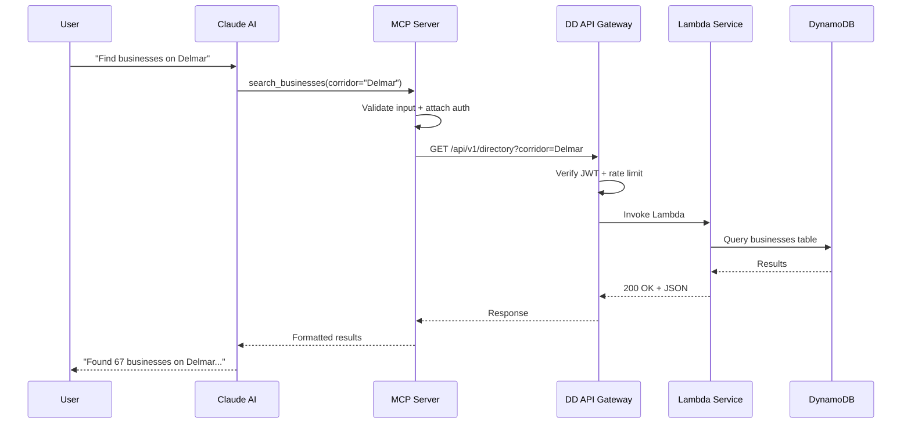

# MCP Connector Guide for Digital District Services

## Purpose

Every Digital District API domain should have a corresponding MCP (Model Context Protocol) connector so that AI assistants (Claude, etc.) can interact with district services natively. This makes the Digital District AI-accessible by default.

## Architecture

```
┌──────────────────────────┐
│   Claude / AI Assistant   │
└──────────┬───────────────┘
           │ MCP Protocol
┌──────────▼───────────────┐
│   MCP Server (Lambda)     │
│   - Tool definitions      │
│   - Auth handling          │
│   - Input validation       │
└──────────┬───────────────┘
           │ HTTPS
┌──────────▼───────────────┐
│   Digital District API    │
│   (API Gateway + Lambda)  │
└──────────────────────────┘
```

### MCP Request Flow



## Standard MCP Servers to Build

| Server Name | API Domain | Key Tools | Priority |
|-------------|-----------|-----------|----------|
| `dd-directory` | Directory APIs | search_businesses, get_business, list_categories | P0 |
| `dd-identity` | Identity APIs | get_profile, update_profile | P1 |
| `dd-intelligence` | Intelligence APIs | generate_content, analyze_data, get_recommendations | P0 |
| `dd-events` | Events APIs | list_events, register_for_event | P1 |
| `dd-metrics` | Metrics APIs | get_ecosystem_health, get_corridor_metrics | P2 |
| `dd-onboarding` | Business APIs | register_business, check_status | P1 |

## Implementation Pattern

### File Structure

```
dd-mcp-servers/
├── packages/
│   ├── dd-directory/
│   │   ├── src/
│   │   │   ├── index.ts          # Server entry point
│   │   │   ├── tools.ts          # Tool definitions
│   │   │   ├── client.ts         # API client wrapper
│   │   │   └── types.ts          # TypeScript interfaces
│   │   ├── package.json
│   │   └── tsconfig.json
│   ├── dd-intelligence/
│   │   └── ...
│   └── dd-events/
│       └── ...
├── shared/
│   ├── auth.ts                   # Shared auth utilities
│   ├── errors.ts                 # Error handling
│   └── config.ts                 # Environment config
├── package.json
└── turbo.json
```

### Example: Directory MCP Server

```typescript
// packages/dd-directory/src/index.ts
import { McpServer } from "@modelcontextprotocol/sdk/server/mcp.js";
import { z } from "zod";
import { DDApiClient } from "./client.js";

const server = new McpServer({
  name: "dd-directory",
  version: "1.0.0",
  description: "Search and browse Digital District business directory",
});

const client = new DDApiClient({
  baseUrl: process.env.DD_API_BASE_URL!,
  apiKey: process.env.DD_API_KEY!,
});

// Tool: Search businesses
server.tool(
  "search_businesses",
  "Search the Digital District business directory by keyword, category, or corridor",
  {
    query: z.string().describe("Search keyword"),
    category: z.string().optional().describe("Business category filter"),
    corridor: z.string().optional().describe("Corridor/node filter"),
    limit: z.number().min(1).max(50).default(10).describe("Max results"),
  },
  async ({ query, category, corridor, limit }) => {
    try {
      const results = await client.searchBusinesses({
        q: query,
        category,
        corridor,
        limit,
      });

      return {
        content: [
          {
            type: "text",
            text: JSON.stringify(results.data, null, 2),
          },
        ],
      };
    } catch (error) {
      return {
        content: [
          {
            type: "text",
            text: `Error searching businesses: ${error instanceof Error ? error.message : "Unknown error"}`,
          },
        ],
        isError: true,
      };
    }
  }
);

// Tool: Get business details
server.tool(
  "get_business",
  "Get detailed information about a specific business in the Digital District",
  {
    business_id: z.string().describe("Business identifier"),
  },
  async ({ business_id }) => {
    try {
      const business = await client.getBusiness(business_id);

      return {
        content: [
          {
            type: "text",
            text: JSON.stringify(business.data, null, 2),
          },
        ],
      };
    } catch (error) {
      return {
        content: [
          {
            type: "text",
            text: `Error fetching business: ${error instanceof Error ? error.message : "Unknown error"}`,
          },
        ],
        isError: true,
      };
    }
  }
);

// Tool: List categories
server.tool(
  "list_categories",
  "List all business categories available in the Digital District directory",
  {},
  async () => {
    try {
      const categories = await client.listCategories();

      return {
        content: [
          {
            type: "text",
            text: JSON.stringify(categories.data, null, 2),
          },
        ],
      };
    } catch (error) {
      return {
        content: [
          {
            type: "text",
            text: `Error listing categories: ${error instanceof Error ? error.message : "Unknown error"}`,
          },
        ],
        isError: true,
      };
    }
  }
);

export default server;
```

### API Client Wrapper

```typescript
// packages/dd-directory/src/client.ts
import { DDConfig } from "../../shared/config.js";

interface SearchParams {
  q: string;
  category?: string;
  corridor?: string;
  limit?: number;
}

export class DDApiClient {
  private baseUrl: string;
  private apiKey: string;

  constructor(config: { baseUrl: string; apiKey: string }) {
    this.baseUrl = config.baseUrl;
    this.apiKey = config.apiKey;
  }

  private async request<T>(path: string, options?: RequestInit): Promise<T> {
    const response = await fetch(`${this.baseUrl}${path}`, {
      ...options,
      headers: {
        "Content-Type": "application/json",
        "X-API-Key": this.apiKey,
        ...options?.headers,
      },
    });

    if (!response.ok) {
      const error = await response.json().catch(() => ({}));
      throw new Error(
        `API Error ${response.status}: ${error?.error?.message || response.statusText}`
      );
    }

    return response.json();
  }

  async searchBusinesses(params: SearchParams) {
    const qs = new URLSearchParams();
    qs.set("q", params.q);
    if (params.category) qs.set("category", params.category);
    if (params.corridor) qs.set("corridor", params.corridor);
    if (params.limit) qs.set("limit", params.limit.toString());

    return this.request(`/api/v1/directory/search?${qs.toString()}`);
  }

  async getBusiness(id: string) {
    return this.request(`/api/v1/businesses/${id}`);
  }

  async listCategories() {
    return this.request("/api/v1/directory/categories");
  }
}
```

## Deployment

### Lambda-Based (Recommended)

```yaml
# serverless.yml (excerpt)
functions:
  dd-directory-mcp:
    handler: packages/dd-directory/dist/lambda.handler
    runtime: nodejs22.x
    memorySize: 256
    timeout: 30
    environment:
      DD_API_BASE_URL: ${ssm:/dd/api/base-url}
      DD_API_KEY: ${ssm:/dd/api/key~true}
    events:
      - httpApi:
          path: /mcp/directory
          method: POST
```

### Environment Variables

All secrets stored in SSM Parameter Store (SecureString):

```bash
# Required for every MCP server
DD_API_BASE_URL    # Base URL of the Digital District API
DD_API_KEY         # API key for machine-to-machine auth

# Optional
DD_MCP_LOG_LEVEL   # debug | info | warn | error (default: info)
DD_MCP_TIMEOUT_MS  # Request timeout in milliseconds (default: 10000)
```

## Testing

Each MCP server should include:

1. **Unit tests** for tool input validation
2. **Integration tests** against a staging Digital District API
3. **Contract tests** to verify MCP protocol compliance
4. **Load tests** to ensure Lambda cold start + response < 3 seconds

## Security Checklist

- [ ] API keys stored in SSM SecureString, never in code
- [ ] Input validation via Zod schemas on all tool parameters
- [ ] Error messages sanitized — no raw stack traces returned
- [ ] Rate limiting enforced at API Gateway level
- [ ] IAM role follows least-privilege principle
- [ ] CloudWatch logging enabled with 90-day retention
- [ ] No user PII logged in tool responses
