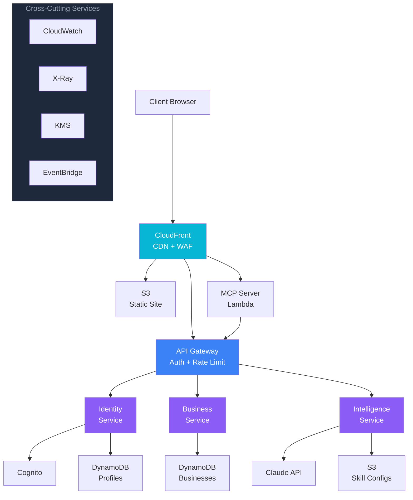

# Reference Architecture

## System Architecture (AWS)

```
                              ┌─────────────────┐
                              │   CloudFront     │
                              │   (CDN + WAF)    │
                              └────────┬────────┘
                                       │
                    ┌──────────────────┼──────────────────┐
                    │                  │                    │
           ┌───────▼──────┐  ┌────────▼────────┐  ┌──────▼───────┐
           │  Static Site  │  │   API Gateway   │  │  MCP Server  │
           │  (S3 + CF)    │  │   (REST API)    │  │  (Lambda)    │
           │  Dashboard,   │  │   Auth, Rate    │  │  Claude      │
           │  Docs, Portal │  │   Limit, CORS   │  │  Integration │
           └───────────────┘  └────────┬────────┘  └──────────────┘
                                       │
                         ┌─────────────┼─────────────┐
                         │             │             │
                  ┌──────▼─────┐ ┌─────▼─────┐ ┌────▼──────┐
                  │  Identity  │ │  Business  │ │ AI/Intel  │
                  │  Service   │ │  Service   │ │  Service  │
                  │  (Lambda)  │ │  (Lambda)  │ │ (Lambda)  │
                  └──────┬─────┘ └─────┬─────┘ └────┬──────┘
                         │             │             │
              ┌──────────┼─────────────┼─────────────┼──────────┐
              │          │             │             │          │
        ┌─────▼───┐ ┌───▼────┐  ┌─────▼───┐  ┌─────▼───┐ ┌───▼────┐
        │Cognito  │ │DynamoDB│  │   S3    │  │ Claude  │ │  SES   │
        │User Pool│ │ Tables │  │ Buckets │  │  API    │ │ Email  │
        └─────────┘ └────────┘  └─────────┘  └─────────┘ └────────┘

        ┌─────────────────────────────────────────────────────────┐
        │                    CROSS-CUTTING                        │
        │  CloudWatch (logging) · X-Ray (tracing) · KMS (keys)   │
        │  SSM (secrets) · EventBridge (events) · SNS (alerts)   │
        └─────────────────────────────────────────────────────────┘
```

### System Architecture (Mermaid)



## Service Boundaries

| Service | Responsibility | Data Store | Key APIs |
|---------|---------------|-----------|----------|
| Identity Service | User registration, auth, profiles | Cognito + DynamoDB (profiles) | /auth/*, /profile/* |
| Business Service | Business CRUD, directory, search | DynamoDB (businesses) | /businesses/*, /directory/* |
| Intelligence Service | AI generation, analysis, skills | S3 (skill configs) + Claude API | /ai/* |
| Events Service | Event listing, registration | DynamoDB (events) | /events/* |
| Metrics Service | KPI computation, dashboard data | DynamoDB (metrics) + S3 (reports) | /metrics/* |
| Notification Service | Email, SMS, push | SES + SNS | Internal only (event-driven) |

## Infrastructure as Code

All resources defined in AWS CDK (TypeScript):

```
infra/
├── bin/
│   └── app.ts                # CDK app entry point
├── lib/
│   ├── network-stack.ts      # VPC, subnets, security groups
│   ├── identity-stack.ts     # Cognito, user pool
│   ├── data-stack.ts         # DynamoDB tables, S3 buckets
│   ├── api-stack.ts          # API Gateway, Lambda functions
│   ├── monitoring-stack.ts   # CloudWatch, alarms, dashboards
│   └── cdn-stack.ts          # CloudFront, WAF, static hosting
├── package.json
└── tsconfig.json
```

## Environments

| Environment | Purpose | Data | Access |
|------------|---------|------|--------|
| Development | Engineering iteration | Synthetic | Engineering team |
| Staging | Pre-production testing | Anonymized copy of production | Engineering + QA |
| Production | Live system | Real user data | Controlled access, audit logged |

---

# Dashboard Specification

## Public Dashboard (Ecosystem Health)

### Layout

```
┌─────────────────────────────────────────────────────────────┐
│  DIGITAL DISTRICT: [CITY NAME]              [date range ▼]  │
├─────────────────────────────────────────────────────────────┤
│                                                             │
│  ┌──────────┐  ┌──────────┐  ┌──────────┐  ┌──────────┐   │
│  │   EII    │  │Businesses│  │   Jobs   │  │ Wi-Fi    │   │
│  │   72/100 │  │   342    │  │   89     │  │ Users    │   │
│  │   ▲ +4   │  │   ▲ +23  │  │   ▲ +12  │  │  4,521   │   │
│  └──────────┘  └──────────┘  └──────────┘  └──────────┘   │
│                                                             │
│  ┌─────────────────────────┐  ┌────────────────────────┐   │
│  │  EQUITY MAP             │  │  BUSINESS FORMATION    │   │
│  │  [heat map by           │  │  [line chart: monthly  │   │
│  │   neighborhood showing  │  │   registrations with   │   │
│  │   business formation    │  │   underserved % overlay│   │
│  │   density]              │  │                        │   │
│  └─────────────────────────┘  └────────────────────────┘   │
│                                                             │
│  ┌─────────────────────────┐  ┌────────────────────────┐   │
│  │  AI TOOL USAGE          │  │  TOP CATEGORIES        │   │
│  │  [bar chart: sessions   │  │  [donut chart:         │   │
│  │   per tool category]    │  │   business types]      │   │
│  └─────────────────────────┘  └────────────────────────┘   │
│                                                             │
│  ┌─────────────────────────────────────────────────────┐   │
│  │  CORRIDOR STATUS                                     │   │
│  │  Delmar: ● Active | Cortex: ● Node | 39N: ● Node   │   │
│  └─────────────────────────────────────────────────────┘   │
└─────────────────────────────────────────────────────────────┘
```

### Data Sources

| Widget | Data Source | Refresh Rate |
|--------|-----------|-------------|
| EII Score | Computed from 4 components (see KPI framework) | Daily |
| Businesses | DynamoDB business count | Real-time |
| Jobs | Quarterly survey + estimates | Quarterly |
| Wi-Fi Users | Network analytics | Hourly |
| Equity Map | Registration addresses geocoded to neighborhoods | Daily |
| Business Formation | DynamoDB registration timestamps | Real-time |
| AI Tool Usage | Application analytics | Daily |
| Top Categories | DynamoDB business categories | Daily |
| Corridor Status | Health check endpoints | Every 5 minutes |

### Technical Implementation

- **Frontend:** React + Vite + Recharts (open-source charting)
- **Data API:** Lambda function computing dashboard metrics from DynamoDB
- **Caching:** CloudFront with 5-minute TTL for dashboard API responses
- **Hosting:** S3 + CloudFront
- **Auth:** No auth required for public dashboard; auth for admin/operational views

---

# Reporting Template

## Quarterly Impact Report — [QUARTER] [YEAR]

### Executive Summary
[2-3 sentences: EII trend, headline numbers, biggest win, biggest challenge]

### Key Metrics

| Metric | This Quarter | Last Quarter | Change | Target |
|--------|-------------|-------------|--------|--------|
| EII Score | | | | |
| Businesses Registered | | | | |
| Businesses Active (30-day) | | | | |
| Jobs Created (estimated) | | | | |
| Wi-Fi Active Users | | | | |
| AI Tool Sessions | | | | |
| % Entrepreneurs from Underserved Areas | | | | |

### Equity Breakdown
[Table or chart showing business formation by neighborhood/ward]

### Highlights
[3-5 bullet points: notable achievements, partnerships, milestones]

### Challenges
[2-3 bullet points: honest assessment of what's not working]

### Next Quarter Priorities
[3-5 bullet points: what the team will focus on]

### Financial Summary

| Category | Budget | Actual | Variance |
|----------|--------|--------|----------|
| Infrastructure | | | |
| Intelligence | | | |
| Applications | | | |
| People | | | |
| Community | | | |
| **Total** | | | |
