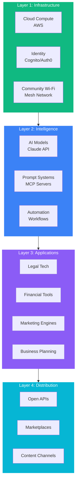
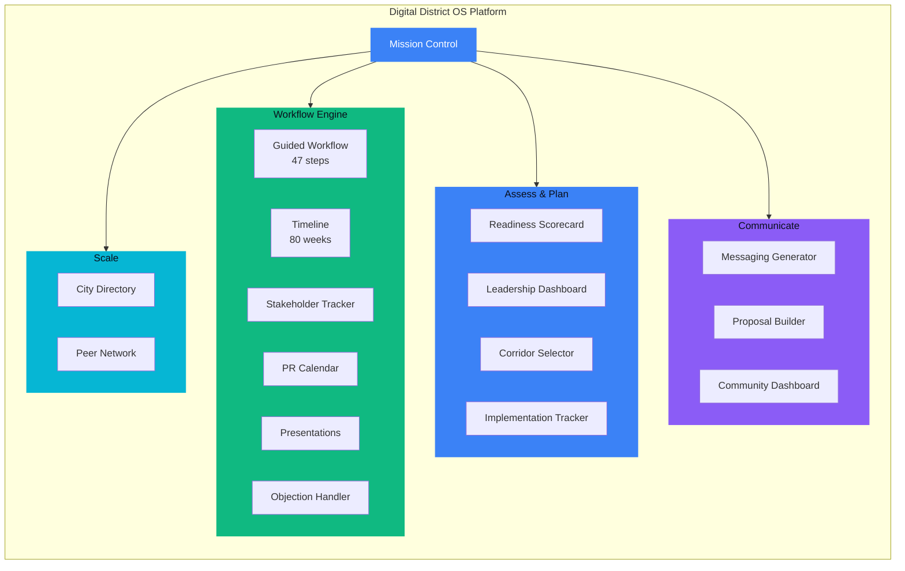
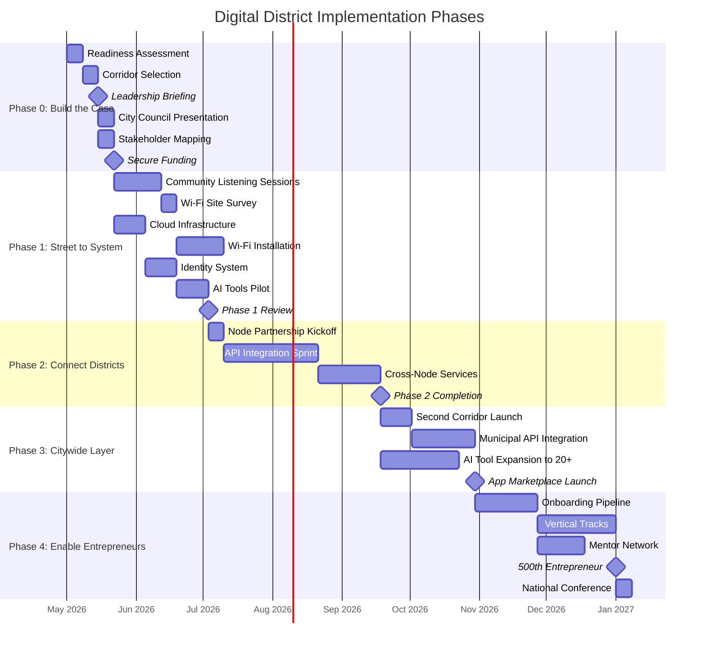
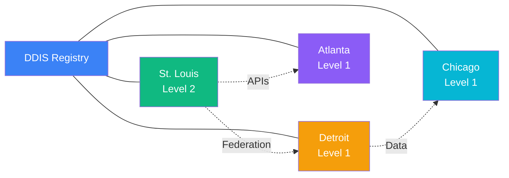
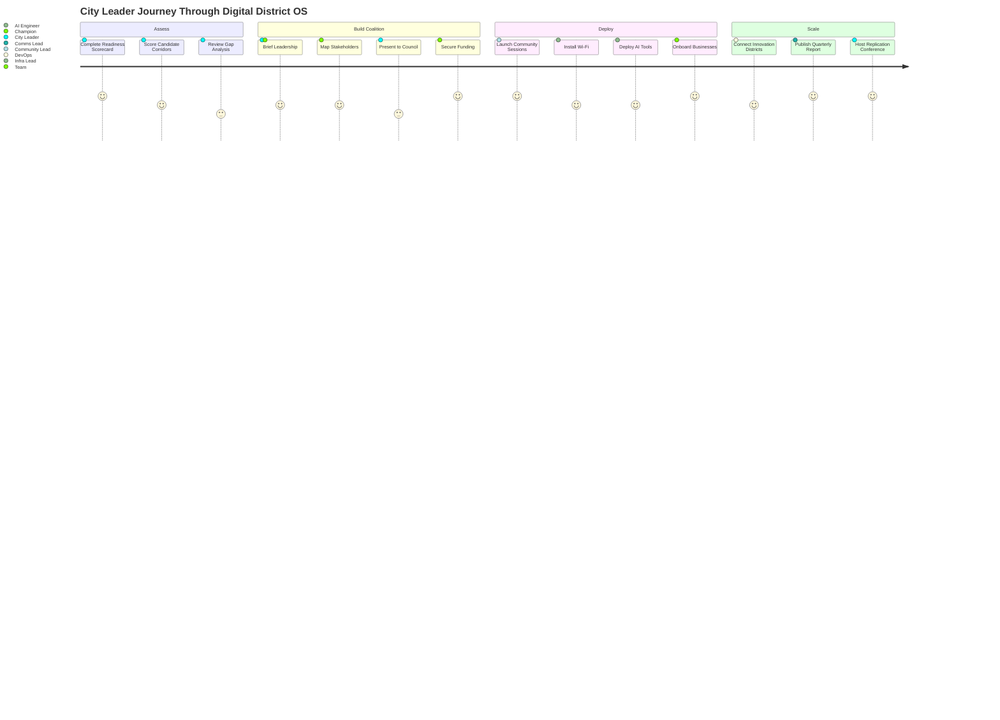

# Digital District Operating System (DDOS)

**The open-source operational framework and interactive platform for building AI-native Digital Districts.**

## What Is This?

This repository contains two things:

1. **A strategic playbook** — 42 markdown documents covering assessment, implementation, messaging, governance, integration, interoperability standards, and metrics for transitioning from legacy Innovation Districts to Digital Districts.

2. **An interactive platform** — A React + TypeScript web application with 17 pages that serves as a workflow-driven assistant, guiding city leaders step-by-step through every task, meeting, presentation, and stakeholder conversation needed to make a Digital District real.

## The Problem

Cities have invested billions in physical Innovation Districts — real estate developments anchored by universities, hospitals, and research labs. These models:

- Depend on geographic proximity that excludes most residents
- Move at the speed of real estate development (years to decades)
- Concentrate access among those who can afford to locate within the district
- Rely on institutional gatekeepers that AI is rapidly displacing

## The Solution: Digital Districts

Digital Districts are AI-powered, cloud-native ecosystems that provide entrepreneurs with instant access to tools, infrastructure, and intelligence — without requiring physical location.

### The 4-Layer Stack



## The Platform

The interactive platform transforms this playbook into a workflow engine. Run `cd platform && npm install && npm run dev` to launch it.

### Platform Architecture



### 17 Interactive Pages

| Section | Pages | What They Do |
|---------|-------|-------------|
| **Command Center** | Mission Control, Home | Daily dashboard aggregating status, next steps, and stakeholder alerts |
| **Workflow Engine** | Guided Workflow, Timeline, Stakeholder Tracker, PR Calendar, Presentations, Objection Handler | 47-step guided process with meetings, agendas, Gantt timeline, stakeholder management, comms calendar, slide generator, and pushback responses |
| **Assess & Plan** | Readiness Scorecard, Leadership Dashboard, Corridor Selector, Implementation Tracker | 8-dimension diagnostic, KPI visualizations, 7-factor corridor scoring, phase checklists |
| **Communicate** | Messaging Generator, Proposal Builder, Community Dashboard | 15+ audience pitches, full city proposals, public equity metrics |
| **Scale** | City Directory, Peer Network | DDIS v1.0 registry, cross-city benchmarks, replication playbook |

## Implementation Phases



| Phase | Name | Duration | Budget | Goal |
|-------|------|----------|--------|------|
| 0 | Build the Case | Weeks 1-4 | — | Assess readiness, select corridor, build coalition, secure funding |
| 1 | Street to System | Weeks 5-20 | $101K-$402K | Deploy Wi-Fi, cloud, AI tools on pilot corridor |
| 2 | Connect Districts | Weeks 17-40 | $180K-$570K | Link Innovation Districts as nodes on a shared network |
| 3 | Citywide Layer | Weeks 40-65 | $1.25M-$4.3M | Expand to citywide operating system |
| 4 | Enable Entrepreneurs | Weeks 60-80 | $500K-$2M | Zero-friction onboarding from any neighborhood |

## Multi-City Network



The Digital District Interoperability Standard (DDIS) v1.0 defines three conformance levels:

| Level | Name | Requirements |
|-------|------|-------------|
| 1 | Observable | Publish district manifest + public API catalog |
| 2 | Connectable | Identity federation + 3+ shared API endpoints |
| 3 | Composable | Full API interop + data sharing + shared metrics |

## Quickstart

### Use the Interactive Platform

```bash
cd platform
npm install
npm run dev
```

Then open the browser and follow the guided workflow from Mission Control.

### Use the Playbook Directly

1. **Understand the thesis:** `00-framework/thesis.md`
2. **Assess your readiness:** `01-assessment/readiness-scorecard.md`
3. **Pick your corridor:** `03-decision-trees/corridor-selection.md`
4. **Build phase by phase:** `02-implementation/` in sequence
5. **Communicate effectively:** `04-messaging/`

## City Leader Journey



## Repository Structure

```
digital-district-os/
├── platform/                   # Interactive React platform (17 pages)
│   ├── src/
│   │   ├── pages/              # All page components
│   │   ├── data/               # Workflow, scoring, and city data
│   │   └── index.css           # Design system
│   └── package.json
├── SKILL.md                    # AI skill routing hub
├── 00-framework/               # Core concepts + mental models
├── 01-assessment/              # Readiness diagnostics
├── 02-implementation/          # Phase-by-phase build guides
├── 03-decision-trees/          # Operational decision frameworks
├── 04-messaging/               # Stakeholder communications
├── 05-collaboration/           # Governance + working groups
├── 06-integration/             # Technical architecture
├── 07-interoperability/        # Cross-city standards (DDIS v1.0)
├── 08-metrics/                 # KPIs + dashboards
├── 09-case-studies/            # Reference implementations
└── templates/                  # Reusable artifacts
```

## Reference Implementation

**St. Louis, Missouri** — From the $1.3B Cortex Innovation Community to the Delmar Digital Mainstreet. See `09-case-studies/st-louis-cortex-to-delmar.md`.

## Who This Is For

- **City officials** evaluating digital infrastructure investments
- **Economic development leaders** modernizing innovation strategy
- **Founders** building within Digital District ecosystems
- **Policy makers** allocating capital between physical and digital assets
- **Community organizations** advocating for inclusive digital access
- **Technologists** designing integration and interoperability layers

## Contributing

See `05-collaboration/contribution-guide.md` for how to contribute.

## License

MIT License. Fork it. Deploy it. Make your city digital-first.
