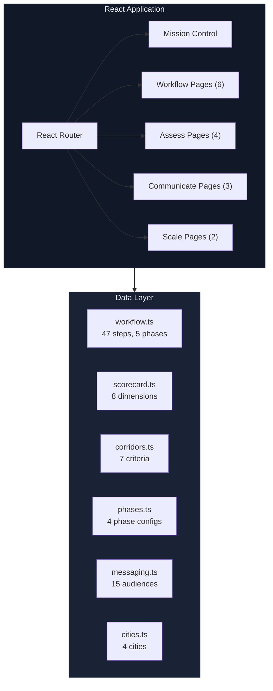
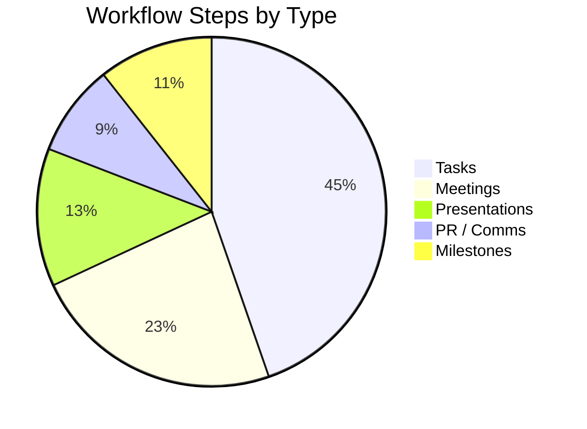

# Digital District OS — Interactive Platform

A React + TypeScript web application that serves as a workflow-driven assistant for building Digital Districts. 17 interactive pages guide city leaders through every task, meeting, presentation, and stakeholder conversation from concept to citywide deployment.

## Getting Started

```bash
npm install
npm run dev
```

## Tech Stack

- **Vite** — Build tool and dev server
- **React 19** — UI framework
- **TypeScript** — Type safety
- **React Router** — Client-side routing with sidebar navigation
- **Recharts** — Radar, bar, line, area, and pie charts
- **Lucide React** — Icon system

## Architecture



## Pages

### Command Center
| Page | Route | Description |
|------|-------|-------------|
| Home | `/` | Landing page with live progress strip and next-step callout |
| Mission Control | `/mission-control` | Daily dashboard: status, this-week tasks, stakeholder pulse, quick actions |

### Workflow Engine
| Page | Route | Description |
|------|-------|-------------|
| Guided Workflow | `/workflow` | 47 sequenced steps across 5 phases with meeting agendas, prep materials, deliverables, and linked tools |
| Timeline & Tasks | `/timeline` | Gantt-style 80-week timeline with owner filtering, today marker, click-to-detail |
| Stakeholder Tracker | `/stakeholders` | Influence/interest scoring, quadrant analysis, engagement status, overdue alerts |
| PR & Comms Calendar | `/communications` | 18 communications items, press release generator, social media templates |
| Presentations | `/presentations` | 6 presentation types with slide content, bullet points, and speaker notes |
| Objection Handler | `/objections` | 12 objection/response pairs across 4 categories with roleplay scenarios |

### Assess & Plan
| Page | Route | Description |
|------|-------|-------------|
| Readiness Scorecard | `/scorecard` | 8-dimension interactive assessment with radar chart and bottleneck analysis |
| Leadership Dashboard | `/dashboard` | EII metrics with executive, operational, and community views |
| Corridor Selector | `/corridor` | 7-factor weighted scoring with radar visualization |
| Implementation Tracker | `/tracker` | Phase 1-4 exit criteria checklists with workstream accordions |

### Communicate
| Page | Route | Description |
|------|-------|-------------|
| Messaging Generator | `/messaging` | 15+ audience-specific customizable elevator pitches |
| Proposal Builder | `/proposal` | Full city proposal generation with city-specific inputs |
| Community Dashboard | `/community` | Public-facing equity metrics, demographics, and business spotlights |

### Scale
| Page | Route | Description |
|------|-------|-------------|
| City Directory | `/directory` | DDIS v1.0 conformance registry with district manifests |
| Peer Network | `/network` | Cross-city discussions, benchmarks, and 8-step replication playbook |

## Workflow Data Model

The platform is driven by `src/data/workflow.ts` which defines 47 workflow steps:



Each step has:
- **Phase** — 0 (Build the Case), 1 (Street to System), 2 (Connect Districts), 3 (Citywide Layer), 4 (Enable Entrepreneurs)
- **Type** — task, meeting, presentation, pr, milestone
- **Owner** — Project Lead, Community Lead, Infrastructure Lead, DevOps Lead, AI Engineer, Communications Lead, etc.
- **Week & Duration** — When it starts and how long it takes
- **Deliverables** — What it produces
- **Dependencies** — What must be done first
- **Meeting Details** — Attendees, duration, timed agenda, prep materials (for meetings/presentations)
- **Linked Tool** — Which platform page to use for this step

## Project Structure

```
src/
├── App.tsx                 # Router + sidebar navigation
├── main.tsx                # Entry point with BrowserRouter
├── index.css               # Design system (CSS variables, components)
├── data/
│   ├── workflow.ts         # 47 workflow steps, 5 phases
│   ├── scorecard.ts        # 8 readiness dimensions
│   ├── corridors.ts        # 7 corridor selection criteria
│   ├── phases.ts           # Phase configs + exit criteria
│   ├── messaging.ts        # 15 audience pitch templates
│   └── cities.ts           # City directory + peer topics
└── pages/
    ├── MissionControl.tsx   # Daily command center
    ├── Workflow.tsx          # Guided step-by-step workflow
    ├── Timeline.tsx          # Gantt chart (80 weeks)
    ├── Stakeholders.tsx      # Influence/interest tracker
    ├── Communications.tsx    # PR & comms calendar
    ├── Presentations.tsx     # Slide generator (6 types)
    ├── Objections.tsx        # Objection handler (12 responses)
    ├── Scorecard.tsx         # Readiness assessment
    ├── Dashboard.tsx         # KPI dashboard (3 views)
    ├── Corridor.tsx          # Corridor selector
    ├── Tracker.tsx           # Implementation checklist
    ├── Messaging.tsx         # Elevator pitch generator
    ├── Proposal.tsx          # City proposal builder
    ├── Community.tsx         # Public dashboard
    ├── Directory.tsx         # City registry
    ├── Network.tsx           # Peer learning network
    └── Landing.tsx           # Home page
```

## Design System

The platform uses CSS custom properties for theming:

| Variable | Value | Usage |
|----------|-------|-------|
| `--bg` | `#0a0e1a` | Page background |
| `--bg-card` | `#111827` | Card backgrounds |
| `--accent` | `#3b82f6` | Primary actions, links |
| `--success` | `#10b981` | Positive states, completed |
| `--warning` | `#f59e0b` | Caution, in-progress |
| `--danger` | `#ef4444` | Errors, blocked states |
| `--purple` | `#8b5cf6` | Meetings, secondary accent |
| `--cyan` | `#06b6d4` | Presentations, tertiary accent |
| `--pink` | `#ec4899` | PR/comms items |

## Building for Production

```bash
npm run build
```

Output goes to `dist/`. Serve with any static file server.

## License

MIT License — same as the parent project.
